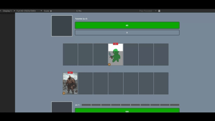
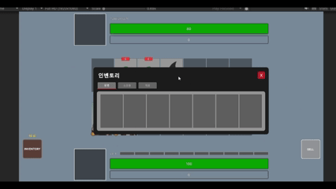

# The Bazaar-style Card Game Prototype

A Unity prototype inspired by The Bazaar that focuses on scalable gameplay architecture rather than complete game content.

The project emphasizes scalable game architecture through data-driven design, including ScriptableObject-based cards, tag-driven classification, automatic role identification, and event-driven gameplay systems.

## Design Goals

The primary objective of this project was not to build a complete game, but to design reusable gameplay systems that can be extended to larger deckbuilding games.

The architecture prioritizes modularity, data-driven design, and maintainability.

## Highlights
- ScriptableObject-based card definitions
- Tag-driven card classification
- Automatic card role classification
- Key-based localization manager
- Modular gameplay architecture
- Drag-and-drop interaction system
- Inventory & equipment management
- Event-driven UI architecture
- Reusable tooltip framework
- Card crafting and upgrade mechanics

## Technical Features
  
### Data-driven Card System

- ScriptableObject-based card definitions
- Separation of data and gameplay logic
- Easy expansion for new cards and items

### Deckbuilding

- Dynamic deck construction
- Card upgrades
- Card removal
- Deck validation

### Inventory System

- Grid-based inventory
- Item storage
- Equipment management
- Runtime inventory updates

### Drag & Drop

- Drag-and-drop interactions
- Slot validation
- Item swapping
- Visual feedback

### Event-driven UI

- Event-based communication between gameplay systems
- Decoupled UI architecture
- Automatic UI synchronization

### Battle System

- Real-Time combat prototype
- Card execution pipeline
- Damage calculation
- Status effect handling

---

## Demo

### 🃏 Card Logic

  

Implementation of core card gameplay mechanics including card activation, turn processing, and effect resolution.

---

### 💬 Tooltip UI

  

Dynamic tooltip system displaying card information, keywords, and item descriptions through reusable UI components.

---

### 🎒 Inventory System

  

Grid-based inventory with drag-and-drop interactions, item swapping, equipment management, and real-time UI synchronization.

---

### 🔨 Card Crafting

  

Card upgrade and crafting system allowing players to combine resources and strengthen their deck.

---
